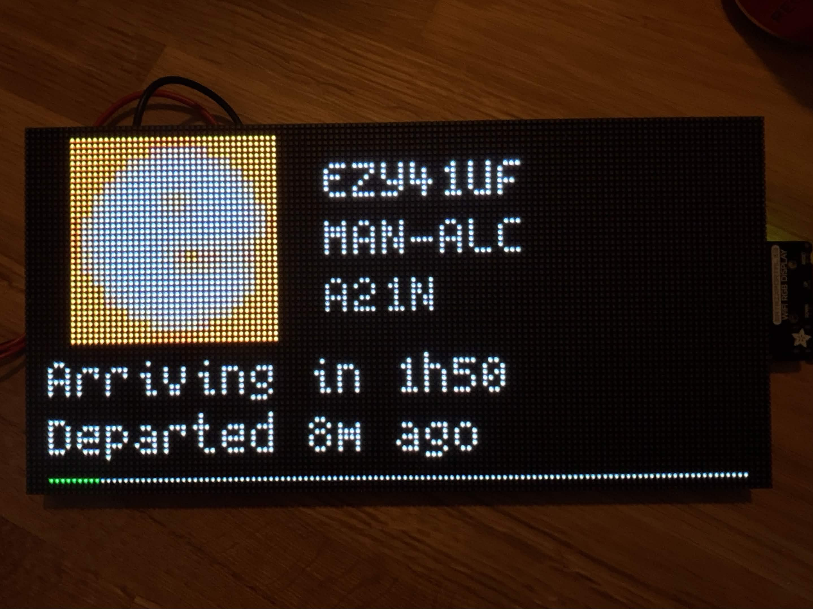

# soko

A real-time flight tracker and radar for RGB LED Matrix Panels, written using CircuitPython. Select a single callsign to follow an individual aircraft, or let it scan the sky overhead and cycle through whatever is nearby. 

## What it shows

There are two modes which you can choose:

**Flight mode** follows one callsign. The airline logo sits on the left with teh callsign, route and aircraft type beside it. Below this sits a status or what the flight is currently doing such as if it's on the ground, how long since deparature and how long remains. This is followed with a progress bar that fills as the aircraft covers the distance between its origin and destination.

**Radar mode** watches for all flights within a radius of your location and rotates through the aircraft inside it every ten seconds, nearest first. Each one shows its route with origin and destination cities, plus range and bearing from the device. 

## Hardware

As long as you can get a Matrix Panel running, you will be able to run this repository. But specific of what I used are:
- Any RGB Matrix Panel, I used a [high resolution 128x64 one.](https://s.click.aliexpress.com/e/_c3mOT811)
- A CircuitPython board with an HUB75 interface, I used a [MatrixPortal S3](https://s.click.aliexpress.com/e/_c4bPcamx)
- A 5V supply.

## Installation

Copy the project onto the CIRCUITPY drive:

```
CIRCUITPY/
├── code.py
├── settings.toml
├── fonts/
│   └── spleen.bdf
├── logos/
│   ├── BAW.bmp
│   ├── EZY.bmp
│   └── ...
└── soko/
    ├── api.py
    ├── app.py
    ├── hardware.py
    ├── model.py
    ├── net.py
    ├── theme.py
    └── screens/
```

Install the libraries with circup:

```
circup install adafruit_bitmap_font adafruit_display_text adafruit_display_shapes adafruit_requests
```

## Configuration

Everything lives in settings.toml. Note that CircuitPython's TOML parser only handles integers and strings, so latitude and longitude must be quoted.

```toml
WIFI_SSID = "your-network"
WIFI_PASSWORD = "your-password"

# "flight" follows one aircraft, "radar" scans your area
MODE = "radar"

# Flight mode: the callsign to follow
CALLSIGN = "BAW117"

# Radar mode: where you are, and how far to look
HOME_LAT = "52.1328"
HOME_LON = "2.9731"
RADAR_NM = 50
```

You should play around with the `RADAR_NM` value to find a balance between seeing aircraft and not overwhelming the board with too much data. For example, if you are close to a major airport, a 50nm radius is reasonable. Otherwise, you may want to increase it to 150nm - which is pretty much most of the UK.

## Layout

All positioning lives in `theme.py` as named constants: row baselines, margins, logo origin and scale, the brightness ladder. Adjusting the layout means editing numbers in one file rather than hunting through the screens.

The brightness values are multiples of `0x20` because the matrix runs at `bit_depth=3`, giving eight levels per channel. Anything between those steps rounds away on the panel, so intermediate values gain you nothing.

## Demo


